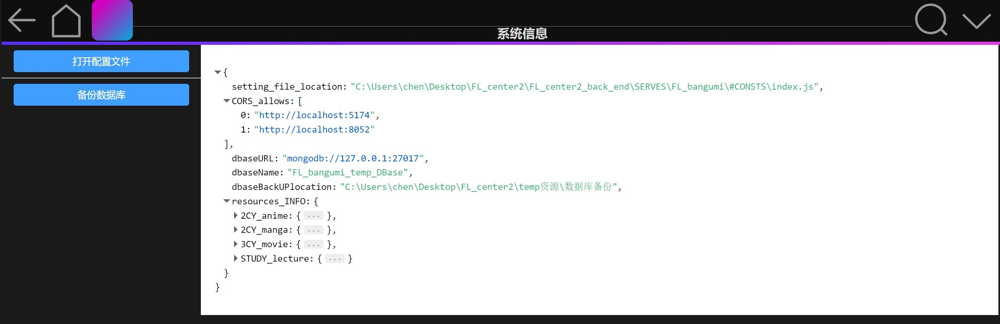
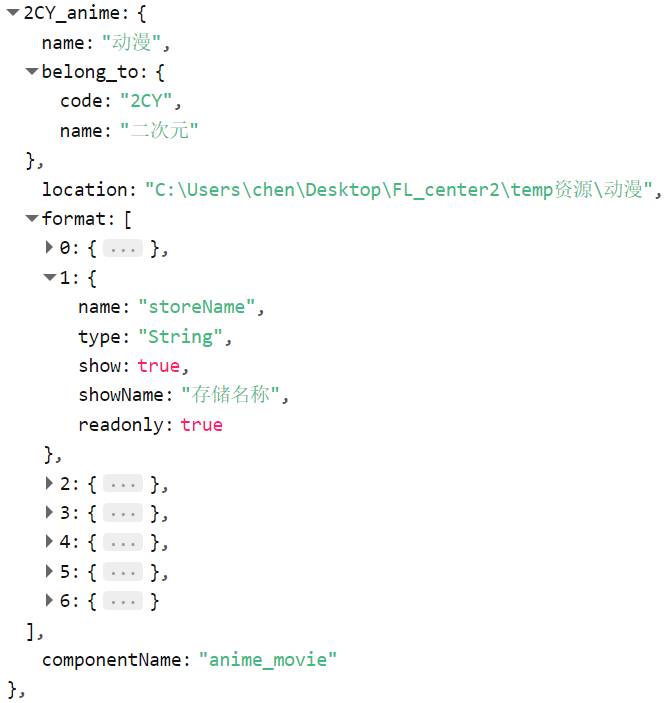
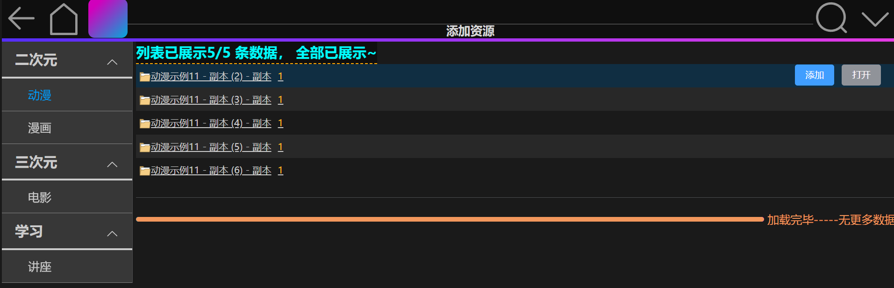
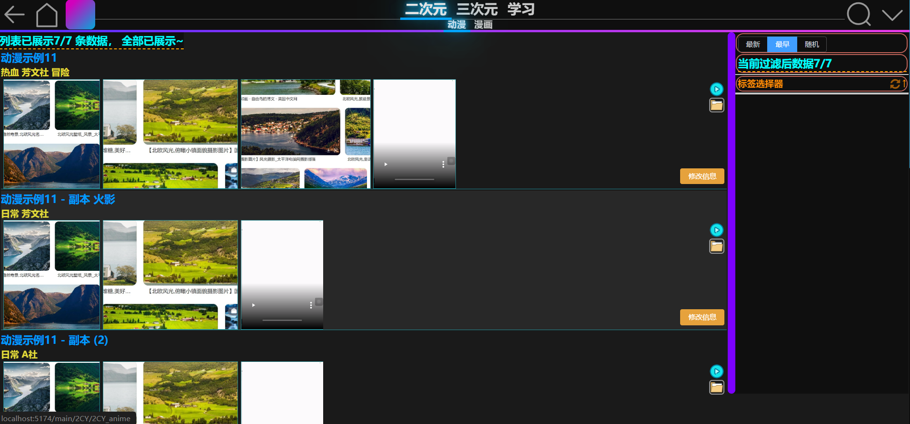

# FL_bangumi

一个本地资源管理应用的前端web项目

> - vue3.0
> - pinia
> - vue-router 4.x
> - element-ui plus

## 版本记录

### v1.0

基本实现了大部分功能。部分功能有待加强和优化。

## 项目特点

### 配置式 设置资源信息

**项目总信息**

**单个资源格式信息**

### 添加资源页面

**由配置的资源格式，自动生成表单**

### 资源展示界面

**自动生成路由**

